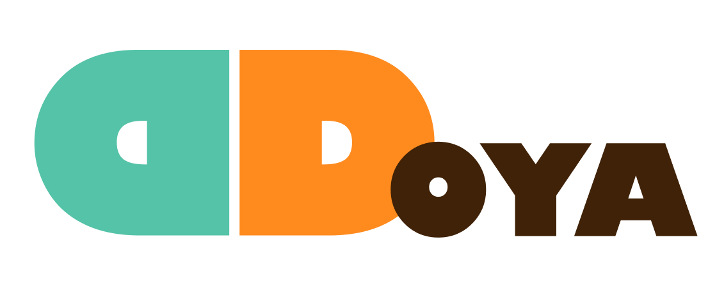
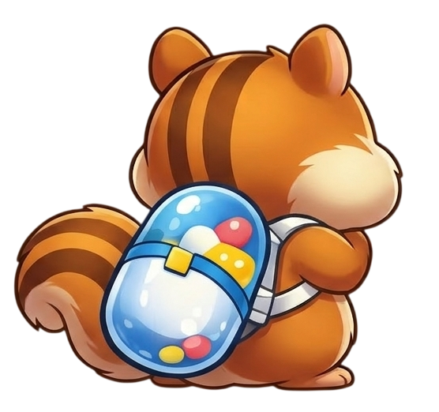
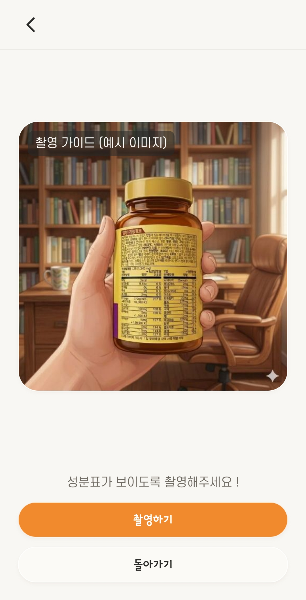
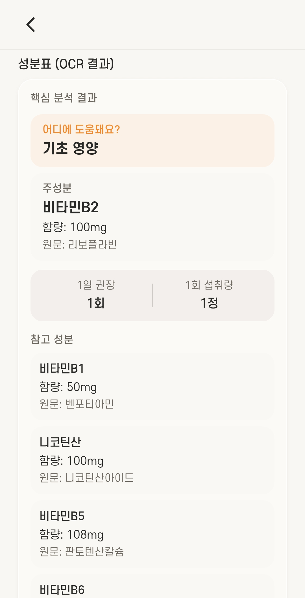
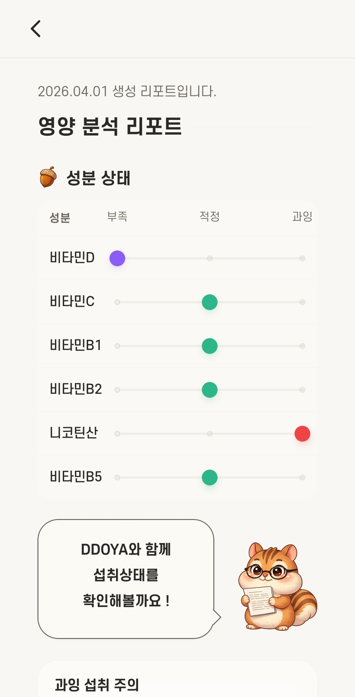
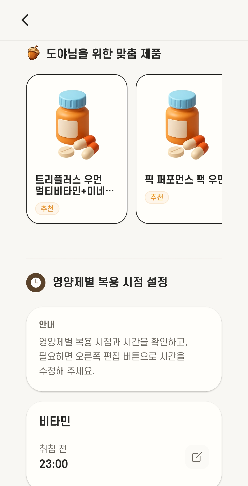
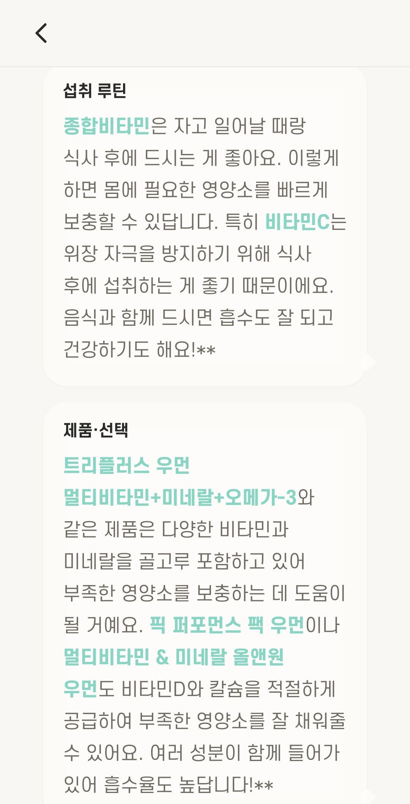
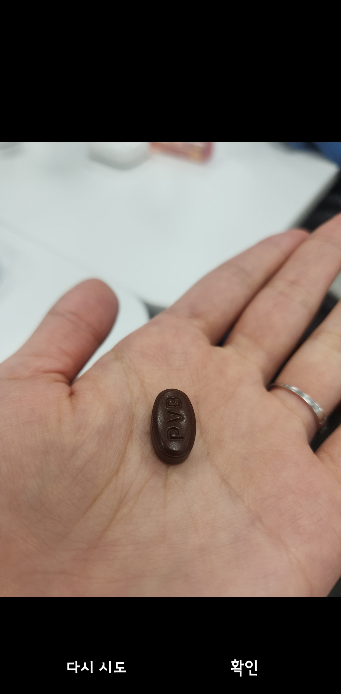
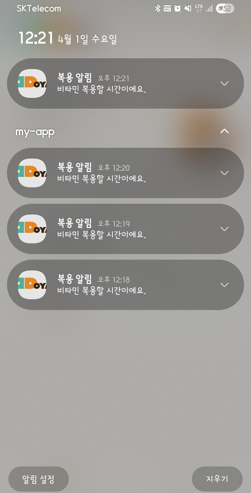
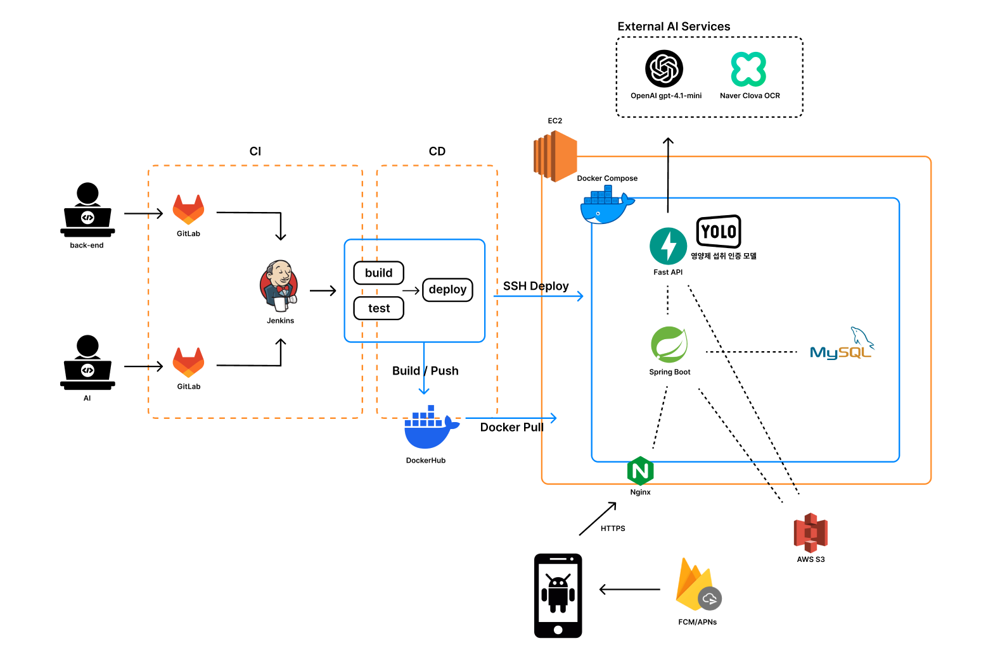

<div align="center">
  <!-- 로고 및 배너 이미지 -->
  
  <br/>
  <!-- 트레이드마크 캐릭터 이미지 (다양한 표정) -->
  
  &nbsp;
  
  &nbsp;
  

  # 💊 DDOYA (또야)

  **"내 영양제, 제대로 알고 먹고 있나요?"**<br>
  AI 비전 스캐닝과 LLM 분석으로 완성하는 **나만의 맞춤 영양제 & 복약 관리 솔루션, 또야**

</div>

<br>

- **개발 기간** : 2026. 02. 23 ~ 2026. 03. 29 (5주)
- **플랫폼** : Native App
- **개발 인원** : 6명 (Frontend 2명, Backend&Infra 2명, AI 2명)
- **소속 기관** : 삼성 청년 SW·AI 아카데미 14기

<br>

<div align="center">

  
  
  
  
  

</div>

---

## 📖 목차
1. [기획 배경 (Why DDOYA?)](#-why-ddoya-기획-배경)
2. [주요 기능 (Key Features)](#-key-features-주요-기능)
3. [기술 스택 (Tech Stack)](#-tech-stack-기술-스택)
4. [시스템 아키텍처 및 AI 파이프라인](#-system-architecture--ai-pipeline)
5. [시작하기 (Getting Started)](#-getting-started)
6. [팀 소개 (Team)](#-team)

---

## ❓ Why DDOYA? (기획 배경)

현대인들은 다양한 영양제와 약을 복용하지만, **정확한 성분 분석과 중복 복용 위험성**을 스스로 파악하기 어렵습니다.

### 1. "내가 먹는 알약이 정확히 뭐지?"
> 💡 **Solution**: 스마트폰 카메라로 알약이나 영양제 성분표를 촬영하면 **AI (YOLOv8 & CLOVA OCR)** 가 즉시 분석하여 정확한 제품 정보와 성분을 추출합니다.

### 2. "이 약이랑 저 약, 같이 먹어도 될까?"
> 💡 **Solution**: **GMS(거대 언어 모델) 연동 RAG 파이프라인**을 통해 사용자가 복용 중인 약물들 간의 **상호작용 및 부작용 확률**을 정밀하게 분석하여 맞춤형 리포트를 제공합니다.

### 3. "아차, 오늘 약 먹었나?"
> 💡 **Solution**: **스마트 복약 캘린더**와 **Firebase Push Notification**을 통해 잊지 않고 꾸준히 복용할 수 있도록 체계적으로 관리해줍니다.

---

## ✨ Key Features (주요 기능)

### 📸 1. AI Vision 스캐닝 (알약 및 성분표 인식)
스마트폰 카메라로 촬영하는 즉시 영양제 정보를 식별합니다.
- **알약 객체 탐지**: 커스텀 학습된 `YOLOv8` 모델을 통해 알약의 형태와 특징을 직관적으로 인식합니다.
- **고정밀 성분표 OCR**: `CLOVA OCR API`를 활용해 곡면이 있는 약병이나 복잡한 성분표에서도 텍스트를 오차 없이 추출합니다.

> **🖥️ 화면 (Screenshots)**
> <div align="center">
>   
>   
>   <p><em>영양제 스캔 및 성분표 OCR 자동 인식 프로세스</em></p>
> </div>

### 📊 2. LLM 기반 맞춤형 영양제 분석 리포트
추출된 성분 데이터를 바탕으로 사용자에게 꼭 맞는 인사이트를 제공합니다.
- **성분 과잉/부족 분석**: 현재 복용 중인 영양제 간에 성분이 과잉되거나 부작용이 없는지 LLM이 판단합니다.
- **맞춤 추천 요약**: 부족한 성분을 보완할 수 있는 맞춤형 일일 루틴과 영양제 추천 사유까지 누구나 이해하기 쉽게 제공합니다.

> **🖥️ 화면 (Screenshots)**
> <div align="center">
>   
>   
>   
>   <p><em>성분 충돌/과잉 경고 및 맞춤형 AI 추천 리포트</em></p>
> </div>

### 📅 3. 스마트 복약 관리 및 캘린더 (Intake Tracking)
투약 일정을 한눈에 파악하고 꼼꼼히 관리합니다.
- **데일리 섭취 루틴**: 주/월간 단위로 복약 여부를 직관적으로 보여주며, 복용할 때마다 간편하게 인증(`섭취완료`)이 가능합니다.
- **푸시 및 재고 알람**: 설정 시간에 맞춘 투약 리마인드(FCM)는 물론, 영양제가 다 떨어져 갈 즈음에 **재고 알람**까지 발송해 투약 공백을 방지합니다.

> **🖥️ 화면 (Screenshots)**
> <div align="center">
>   
>   
>   
>   <p><em>직관적인 섭취 캘린더 관리와 스마트 알림 시스템</em></p>
> </div>

### 👤 4. 사용자 맞춤형 프로필 및 히스토리 관리
- 사용자의 기본 건강 정보 취합 및 Oauth 기반 인증을 거친 안전한 내 정보 관리.
- 이전에 스캔했던 영양제 목록과 분석 리포트 히스토리를 언제든 한눈에 빠르게 재열람할 수 있습니다.

---

## 🛠 Tech Stack (기술 스택)

### **📱 Frontend (Mobile App)**
| 분류 | 기술 |
| :---: | :--- |
| **Framework** |   |
| **Styling** |  (NativeWind v4) |
| **State & Data** |    |
| **Libraries** | `expo-camera`, `expo-notifications`, `react-native-calendars` |

### **⚙️ Backend (API Server)**
| 분류 | 기술 |
| :---: | :--- |
| **Framework** |   |
| **Database** |   `QueryDSL` |
| **Security** |   |
| **Features** |  (푸시 알림) <br>  (이미지 스토리지) |
| **Optimization** | `Thumbnailator`, `Scrimage` (이미지 최적화) |

### **🧠 AI & Data Analytics**
| 분류 | 기술 |
| :---: | :--- |
| **Serving** |    |
| **Vision** |  (커스텀 객체 탐지: `yolo_pill_best.pt`) |
| **OCR / LLM** |  <br>  (성분 분석 및 RAG 프록시) |

### **🏗 DevOps & Infra**
| 분류 | 기술 |
| :---: | :--- |
| **CI / CD** |   (무중단 배포 스크립트) |
| **Container** |   |
| **Proxy / Web** |  (SSL/TLS Let's Encrypt 자동화) |

---

## 🏗 System Architecture & AI Pipeline

### 🌐 인프라 아키텍처

<div align="center">
  
</div>

### 🧠 AI 분석 파이프라인 (3-Tier Pipeline)

```mermaid
graph TD
    User([📱 사용자 스마트폰])

    subgraph "1. 성분표 스캐닝 (OCR Pipeline)"
        User -->|영양제 라벨 촬영| API1[FastAPI /analyze]
        API1 -->|이미지 평탄화| CLOVA[CLOVA OCR]
        CLOVA -->|원시 텍스트| API1
        API1 -->|텍스트 정제 및 추출| LLM1[GMS OpenAI]
        LLM1 -->|구조화된 성분 반환| User
    end

    subgraph "2. 맞춤 분석 리포트 (Report Pipeline)"
        User -->|복용 목록을 기반으로 분석 요청| API2[FastAPI /generate]
        API2 -->|상호작용 및 과잉/결핍 연산| DB[(성분/상호작용 마스터 DB)]
        DB -->|결과 요약 및 부족 제품 추천| LLM2[GMS OpenAI]
        LLM2 -->|맞춤형 개인 리포트 반환| User
    end

    subgraph "3. 복약 인증 (Vision Pipeline)"
        User -->|섭취할 알약들 촬영| API3[FastAPI /verify]
        API3 -->|알약 객체 탐지| YOLO[YOLOv8 모델]
        YOLO -->|크롭 및 특성 추출| DINO[DINOv2 임베딩 추출]
        DINO -->|유사도 스코어 매칭| API3
        API3 -->|최종 복약 인증 결과 반환| User
    end